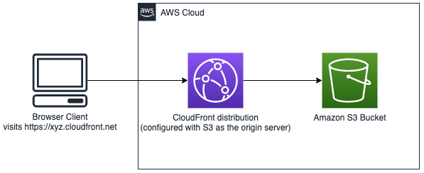

# Webhosting with S3 and Cloudfront

This is a project for deploying the infrastructure to host a static website with [Amazon Cloudfront](https://aws.amazon.com/cloudfront/) and [Amazon S3](https://aws.amazon.com/s3/)

 


We'll be using [CDK](https://docs.aws.amazon.com/cdk/latest/guide/home.html) for creating our infrastructure.

First, make sure you clone this project

```
$git clone https://github.com/gmansilla/s3-cloudfront-hosting.git && cd s3-cloudfront-hosting
```

This project is set up like a standard Python project.  The initialization
process also creates a virtualenv within this project, stored under the `.venv`
directory.  To create the virtualenv it assumes that there is a `python3`
(or `python` for Windows) executable in your path with access to the `venv`
package. If for any reason the automatic creation of the virtualenv fails,
you can create the virtualenv manually.

To manually create a virtualenv on MacOS and Linux:

```
$ python3 -m venv .venv
```

After the init process completes and the virtualenv is created, you can use the following
step to activate your virtualenv.

```
$ source .venv/bin/activate
```

If you are a Windows platform, you would activate the virtualenv like this:

```
% .venv\Scripts\activate.bat
```

Once the virtualenv is activated, you can install the required dependencies.

```
$ pip install -r requirements.txt
```

Prior to deploying, we need to bootstrap CDK

```
$cdk bootstrap
```

And we're ready to deploy!

```
$cdk deploy
```

Pay attention to the Output of this command as this will tell you the URL of your new website.

The URL should be next to ```s3-cloudfront.CloudFrontWebDistribution```


## Destroying the stack ##

After you experiment with this project, you should delete the contents of your buckets (and any versions of objects) and run ```$cdk destroy```
Note: this command will attempt to destroy all components created and can fail if you still have objects in your buckets.

Enjoy!
